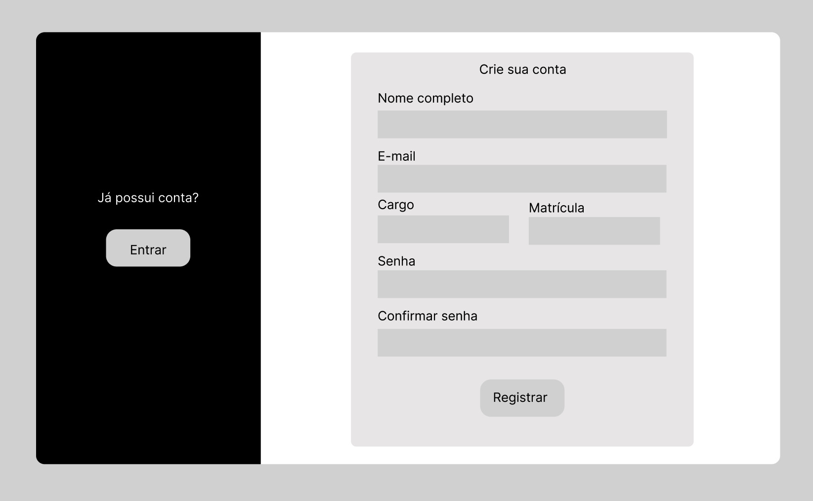

# Protótipos

## Versionamento 
| Versão | Data | Modificação | Autor | 
|--|--|--|--| 
|1.0| 11/05/2023 | Criação da branch protótipo e adição dos protótipos de média fidelidade | Artur Rodrigues e Guilherme Soares | 
|1.1| 12/05/2023 | Atualização da branch | Artur Rodrigues |
|2.0| 12/05/2023 | Criado o protótipo de alta fidelidade da tela de login | Pedro Braga e Yan Lucca |
|2.1| 12/05/2023 | Criado o protótipo de alta fidelidade da tela de cadastro | Artur Rodrigues |
|2.2| 13/05/2023 | Adicionado o protótipo de alta fidelidade da tela de cadastro e login| Artur Rodrigues e Pedro Braga |
|3.0| 16/05/2023 | Alterado e melhorado o protótipo de alta fidelidade da tela de cadastro e login| Artur Rodrigues e Letícia Resende|

## Protótipos de Média Fidelidade

Protótipos de média fidelidade são modelos interativos e visualmente mais próximos do produto final, que são criados durante o processo de design de produto ou desenvolvimento de software. Embora não sejam tão refinados quanto os protótipos de alta fidelidade, que geralmente apresentam detalhes visuais e funcionais altamente precisos, os protótipos de média fidelidade permitem testes e validações das ideias do produto de forma rápida e eficiente.

 

Tela de Login

 

Tela de Cadastro

 

## Protótipo de Alta Fidelidade
Protótipos de alta fidelidade em desenvolvimento de software são modelos interativos que imitam a aparência e funcionalidade de um produto final de software de maneira muito próxima. Eles são projetados para simular a experiência do usuário final com o produto, permitindo que os desenvolvedores testem a usabilidade, funcionalidade e aparência do produto antes de iniciar o desenvolvimento real.

 

Tela de Login e de Cadastro

<iframe style="border: 1px solid rgba(0, 0, 0, 0.1);" width="800" height="450" src="https://www.figma.com/embed?embed_host=share&url=https%3A%2F%2Fwww.figma.com%2Ffile%2FzyNXXEdSgbYnXQorSQPRgA%2FProt%25C3%25B3tipos-de-Alta-Fidelidade---DNIT%3Ftype%3Ddesign%26node-id%3D0%253A1%26t%3DdaJ4rAnQhQU3aqFi-1" allowfullscreen></iframe>