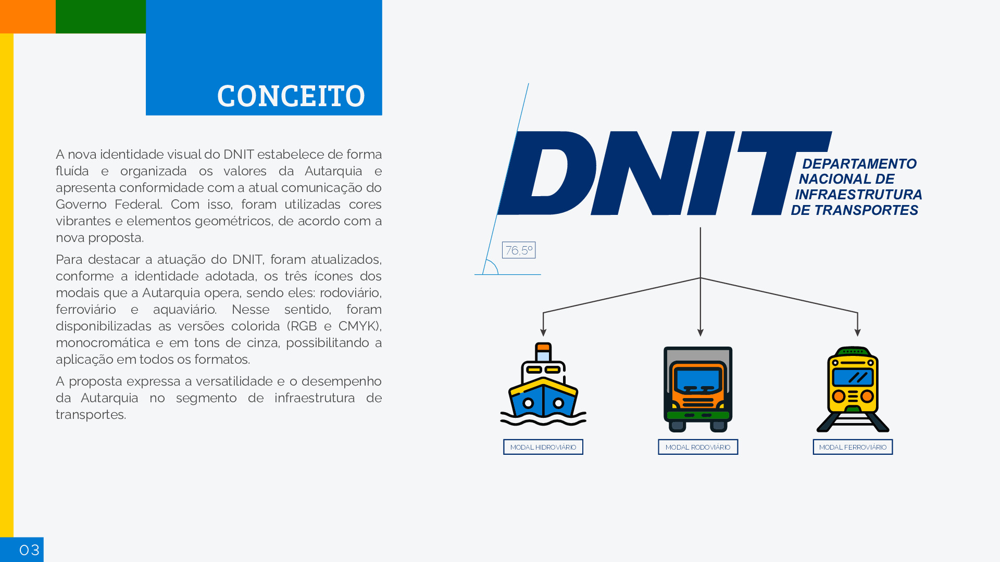
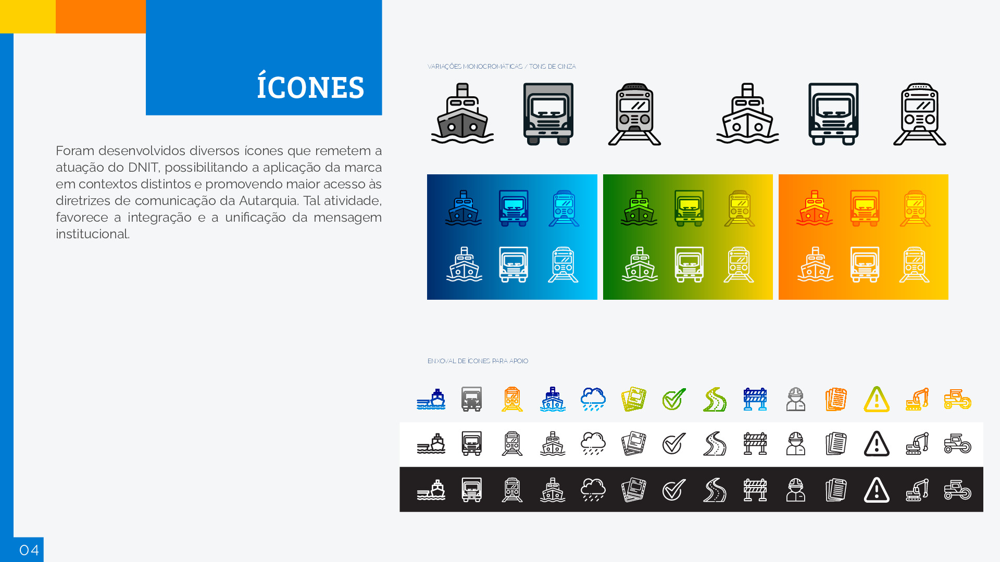
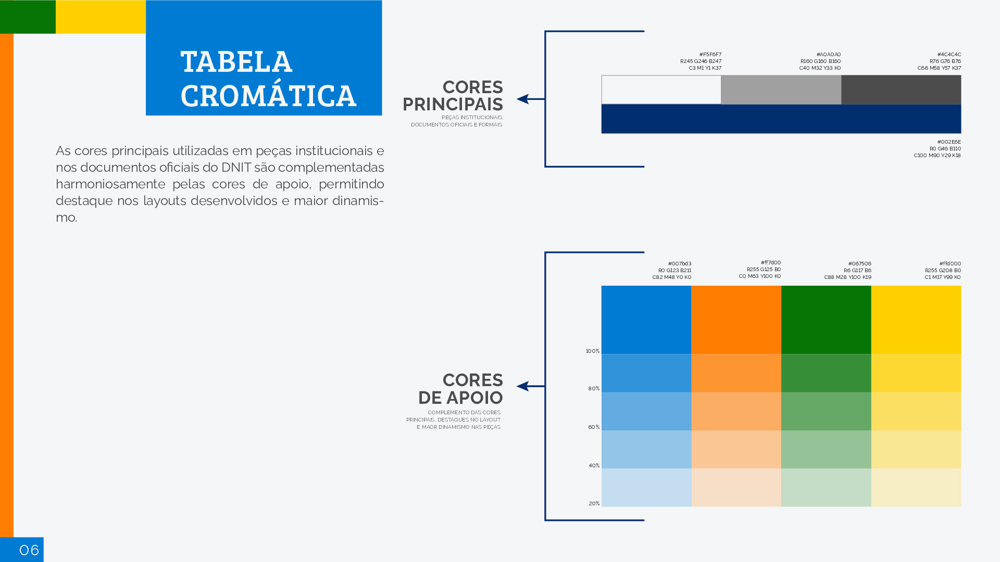
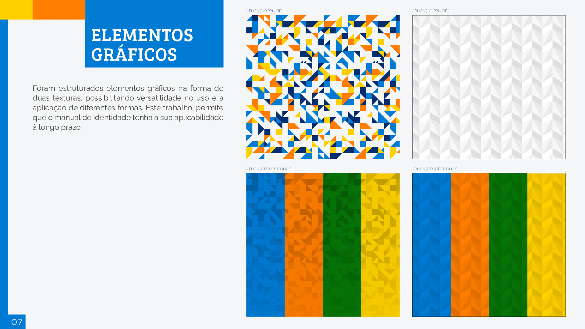
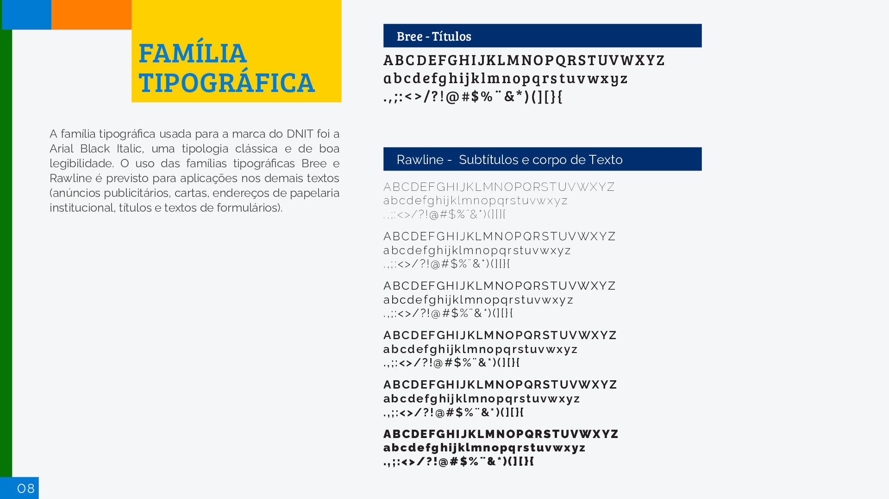
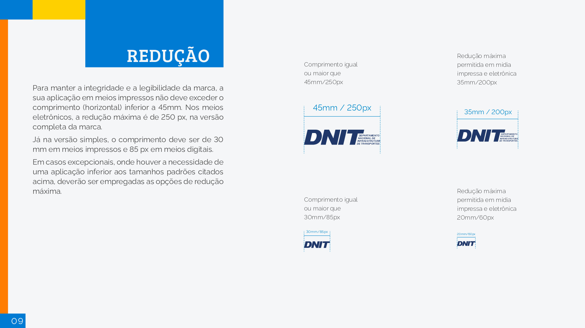
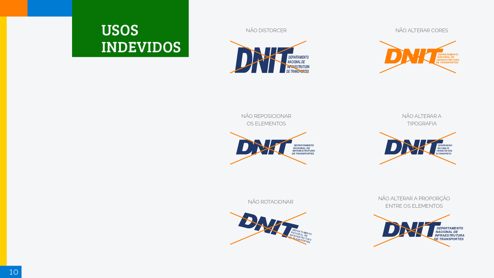
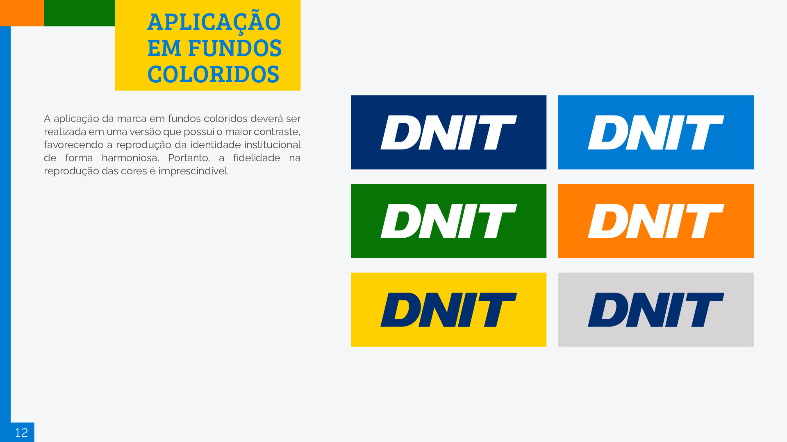
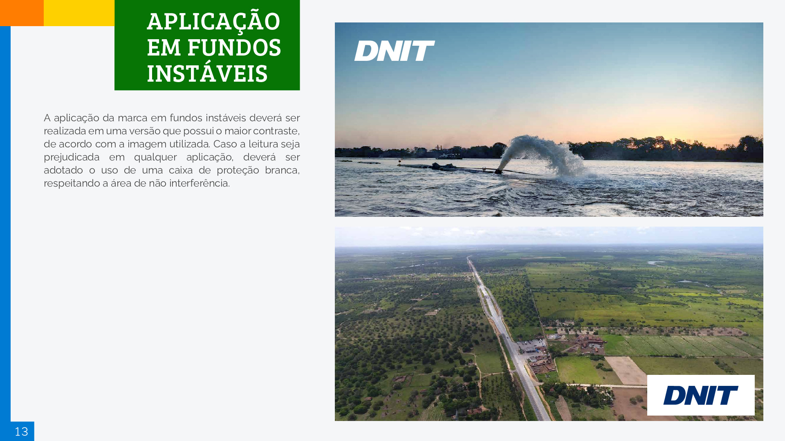
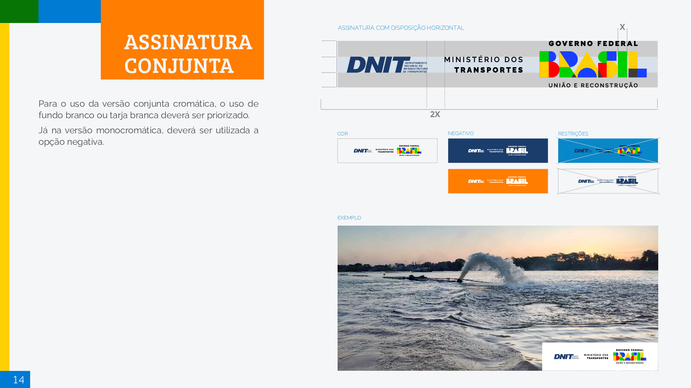

---
hide:
  - navigation
#   - toc
---

# Identidade Visual

## Introdução

Abaixo se encontra o Manual de Gestão de Marca do DNIT, fornecido pelo mesmo em 11/05/2023.
Este manual descreve a identidade visual que deve ser seguida na construção deste projeto.  

## Manual

### Conceito

### Icones

### Apresentação

### Cores

### Elementos gráficos

### Tipografia

### Tamnho da logo

### Usos indevidos

### Caixa de proteção

### Logo em fundos coloridos

### Logo em fundos instaveis

### Assinatura conjunta

## Histórico de versionamento

| **Data**   | **Descrição**                                                                 | **Autor(es)**         |
| ---------- | ----------------------------------------------------------------------------- | --------------------- |
| 18/05/2023 | Criação da pagina e adição do manual de identidade visual fornecido pelo DNIT | João Gabriel de Matos |