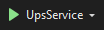

## Frontend

O frontend é a parte da aplicação com a qual os usuários interagem diretamente. Ele se concentra em projetar e implementar a interface visual e interativa, tornando o software fácil de usar e visualmente atraente. O frontend é responsável por exibir informações, capturar entradas dos usuários e transmitir essas informações aos serviços para processamento. Em suma, o frontend tem como objetivo proporcionar uma experiência agradável e intuitiva para os usuários, facilitando a interação com o software.

Neste projeto, o frontend foi criado utilisando a linguagem typescript, com as bibliotecas React e Ant Design.

### Como instalar

#### Pré-requisitos

- Instalar a versão LTS do NodeJS
- instalar o yarn

E caso vá utilizar o docker-compose:

- Instalar o docker
- Instalar o docker-compose

#### Com o docker-compose

O  Docker é uma ferramenta criada facilitar o desenvolvimento, a implantação e a execução de aplicativos, permitindo que eles sejam isolados e executados de forma consistente em diferentes ambientes (como sistemas operacionais diferentes). 

##### Passo-a-passo

* Na primeira vez que for usar, ou após instalar uma nova dependencia.
  * No terminal, dentro da raiz do projeto:
    1. Rode o comando `yarn`, e aguarde a conclusão de sua execução
    2. Rodar o comando `sudo docker-compose build`, e aguarde a conclusão de sua execução
    3. E por fim, rode o comando `sudo docker-compose up`, para iniciar a aplicação
   
* Nas vezes subsequentes, caso não tenha adicionado novas dependencias:
  * Rodar o comando `sudo docker-compose up`
* Agora a interface pode ser utilizada no navegador com o endereço _http://localhost:3000_

#### Sem utilizar o docker-compose

#### Passo-a-passo

* Na primeira vez que for usar, ou após instalar uma nova dependencia.
  * No terminal, dentro da raiz do projeto:
    1. Rode o comando `yarn`, e aguarde a conclusão de sua execução
    2. Rode o comando `yarn start`
   
* Nas vezes subsequentes, caso não tenha adicionado novas dependencias:
  * Rodar o comando `yarn start`
* Agora a interface pode ser utilizada no navegador com o endereço _http://localhost:3000_


### Encerrando a aplicação

* Para encerrar execução da aplicação:
  1. Vá até o terminal em que a mesma esta sendo executada.
  2. Pressione simultaneamente as teclas **ctrl**+**c**.

## Microsserviços

Microsserviços são uma abordagem de arquitetura de software em que um aplicativo é dividido em componentes independentes chamados de microsserviços. Cada microsserviço possui uma funcionalidade específica e se comunica com outros microsserviços através de interfaces bem definidas. Essa abordagem oferece modularidade, permitindo que cada componente seja desenvolvido, implantado e escalado de forma independente. Os microsserviços podem ser desenvolvidos em linguagens e tecnologias diferentes, facilitando a escolha das melhores ferramentas para cada funcionalidade. Além disso, os microsserviços podem ser distribuídos em servidores diferentes ou na nuvem, o que facilita a escalabilidade do sistema. Em resumo, os microsserviços proporcionam flexibilidade, modularidade e escalabilidade ao desenvolvimento de aplicativos.

No caso deste projeto, temos 3 microserviços, sendo estes desenvolvidos na linguagem C# (C sharp), com uso do framework .NET (dotnet), sendo que estes fazem o tratamento e manipulações das informações que estão sendo enviadas para o banco de dados, ou requisitadas pelo frontend.

### Os nossos microsserviços

<!-- Os nossos microsserviços são: -->

- [UsuarioService](https://github.com/fga-eps-mds/2023.1-Dnit-UsuarioService): Serviço responsavel pelas funcionalidades relacionadas à autentificação (cadastro de usuarios, login, solicitação de recuperação de senha, redefinição de senha).
- [EscolaServices](https://github.com/fga-eps-mds/2023.1-Dnit-EscolaService): Serviço responsavel pelas funcionalidades relacionados as escolas (cadastro, busca, atualização e exclusão de escolas,e solicitações para ação do DNIT).
- [UpsService](https://github.com/fga-eps-mds/2023.1-Dnit-UpsService): Serviço responsavel pelas funcionalidades relacionadas a acidentes de tránsito (cadastro de sinistros, calculo de UPS, cadastro e atualização dos dados de rodovia).

### Como instalar

A forma de instalação é igual para todos os serviços, havendo diferenças apenas com base no sistema operacional.

_Observação_: No EscolaServices, é necessario adicionar um arquivo ".env" dentro da pasta "app", com as seguintes informações:

    - EMAIL_SERVICE_ADDRESS : email usado para enviar a mensagem.
    - EMAIL_SERVICE_PASSWORD: senha do email acima.
    - EMAIL_DNIT: email que receberá a mensagem.


#### Windows e MacOs

##### Modo 1

- Abra um navegador da web e acesse o site oficial da Microsoft .NET: https://dotnet.microsoft.com/download/dotnet/6.0
- Role a página até a seção ".NET 6 SDK" e clique no botão de download adequado para seu sistema operacional (por exemplo, "macOS x64 Installer" para macOS 64 bits ou  "Windows x64 Installer" para Windows 64 bits).
- O arquivo de instalação será baixado. Depois que o download for concluído, clique duas vezes no arquivo para iniciá-lo.
- O instalador será aberto. Leia e aceite os termos de licença.
- Selecione as opções de instalação que você deseja.
- Clique no botão "Install" (Instalar) para iniciar a instalação do .NET 6.
- Após a conclusão da instalação, você verá uma tela informando que o .NET 6 SDK foi instalado com sucesso.
- Para verificar se a instalação foi bem-sucedida, abra o Prompt de Comando ou o PowerShell e execute o seguinte comando:

```bash
dotnet --version
```
- Isso exibirá a versão do .NET instalada, confirmando se o .NET 6 está configurado corretamente.

##### Modo 2

Basta instalar a IDE [Visual Studio](https://visualstudio.microsoft.com/pt-br/free-developer-offers/) escolhendo a versão gratuita (Versão Community). Após instalar o Visual Studio, ele automaticamente irá instalar o .NET com a versão mais estável.

#### Linux

Instale o SDK do *.*NET .

```bash
sudo apt-get update && \
  sudo apt-get install -y dotnet-sdk-6.0
```

Instale o runtime ASP.NET Core.

```bash
sudo apt-get update && \
  sudo apt-get install -y aspnetcore-runtime-6.0
```

Entre na pasta do serviço. Dentro da pasta "app" rode o comando:

```bash
dotnet run
```
### Clonar Aplicação

Para clonar o repostório, basta utilizar os comandos abaixos:

##### UsuarioService
```
git clone https://github.com/fga-eps-mds/2023.1-Dnit-UsuarioService.git
```
##### UpsService
```
git clone https://github.com/fga-eps-mds/2023.1-Dnit-UpsService.git
```
##### EscolaService
```
git clone https://github.com/fga-eps-mds/2023.1-Dnit-EscolaService.git
```
### Como Rodar
#### Usando Visual Studio

Para rodar uma aplicação usando Visual Studio, basta clicar no arquivo com extenção 'sln' e em seguida clicar no ícone para rodar aplicação conforme mostra abaixo:
<br>


#### Usando Visual Studio Code

Para rodar utilizando o VS Code, basta seguir a seguinte instrução:

Entre na pasta do serviço. Dentro da pasta "app" rode o comando:

```bash
dotnet run
```


### Encerrando a aplicação

No terminal em que a aplicação esta rodando, digite simultaneamente as teclas **ctrl**+**c**. Caso esteja utilizando o Visual Studio, clique no ícone quadrado vermelho <br>


## Histórico de versionamento

| Versão | Data       | Modificação                                                 | Autor                 |
| ------ | ---------- | ------------------------------------------------------------| --------------------- |
| 1.0    | 08/07/2023 | Abertura do documento e instruções para o frontend.         | João Gabriel de Matos |
| 1.1    | 08/07/2023 | Incio do manual dos microserviços.                          | João Gabriel de Matos |
| 1.2    | 09/07/2023 | Atualização documento, detalhando itens para microserviços  | Denys Rógeres         |
