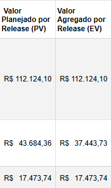
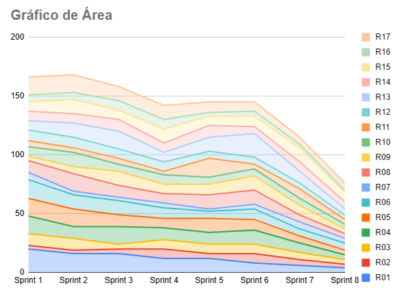
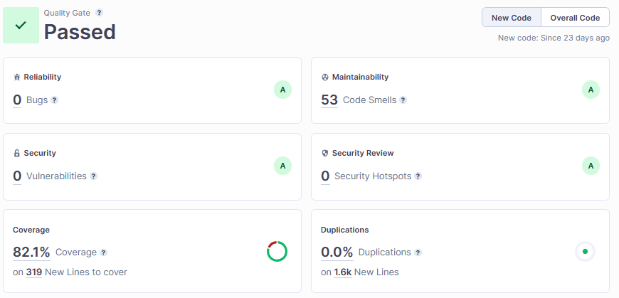

# Planejado X Realizado

# Introdução

Este documento tem como objetivo apresentar a análise comparativa entre o planejamento e a execução no desenvolvimento do projeto. Serão avaliados e comparados o Backlog com as Histórias de Usuários (US), o Custo, Risco e a Qualidade, a fim de compreender o progresso do projeto.

# Backlog

O Backlog do projeto pode ser acessado em detalhes no [Github Projects](https://github.com/orgs/fga-eps-mds/projects/9).

## Planejado

- US01
- US02
- US04
- US05
- US06
- US07
- US08
- US09
- US10
- US11
- US12

## Realizado

- US01
- US02
- US04
- US05
- US06
- US07
- US08
- US12
- **US13**
- **US14**
- **US15**
- **US19**
- **US20**

## Análise

Ao comparar o Backlog planejado pelo realizado, podemos notar uma diferença em relação a uma parte das User Stories (em negrito).

O Backlog inicialmente planejado para o projeto contemplava as funcionalidades como Login/Cadastro (US01, US02 e US04), Gerenciamento de escolas e situação, Importação de dados de escola por planilha (US06, US07 e US08), Solicitação de ação ao DNIT (US12), e também a parte de Automação do processo de priorizações de escolas (US09, US10 e US11). 

No entanto essa última funcionalidade envolvendo priorização de escolas não pôde ser realizada no tempo estipulado para o projeto. Isso ocorreu porque, ao decorrer do projeto, percebemos que essa funcionalidade é dependente do valor de UPS da escola, e o cálculo de UPS estava previsto para ser feito em outra funcionalidade do Backlog, representadas pelas User Stories 13, 14 e 15. 

Vale ressaltar que a funcionalidade de Automação de priorização de escolas havia sido projetada no Backlog inicial porque construímos esse planejamento considerando o valor de UPS já calculado e inserido no momento de cadastro de escolas. Porém, após um dos PO's voltar de férias, foi trago uma nova visão do produto que estava sendo desenvolvido, elucidando essa questão do cálculo de UPS, que na visão dele, deveria ser automatizado assim como a priorização de escolas, agragando mais valor ao produto.

Com a colocação desse PO, tivemos que adaptar nosso planejamento para primeiro automatizar o Cálculo de UPS, e depois seria realizado a Automação de priorização de escolas, no entanto essa última funcionalidade foi retirada do planejamento devido ao deadline do projeto.

Ademais, as US19 e US20 são duas histórias de usuários simples que surgiram a partir da necessidade de uma melhor navegabilidade para o usuário, adicionando uma tela de Dashboard, oferecendo acesso para todas funcionalidades desenvolvidas e uma tela HomePage que apresenta informações do projeto para o usuário.

# Custo

Esta seção representa a comparação entre o planejamento e a execução do projeto, focando especificamente no aspecto do custo. Aqui, são analisados e confrontados os custos estimados e os custos reais, buscando identificar as diferenças dentre esses dois aspectos.

O planejamento de custos do projeto em mais detalhes pode ser acessado no [plano de custos](https://fga-eps-mds.github.io/2023-1-Dnit-DOC/gestaoDoProjeto/planoDeCusto/). A projeção de custo é feita com base no custo de cada integrante, custo de internet e energia ao longo da duração do projeto. Além do custo de equipamentos considerando a primeira sprint.

Na imagem acima podemos ver uma comparação do planejamento e o executado considerando o custo. O custo planejado é representado pelo campo Valor Planejado por Release (PV) e o custo realizado é representado pelo campo Valor Agregado por Release (EV), ambas informações retiradas do EVM do projeto. A primeira linha refere-se à Release 1, a segunda à Release 2 e a terceira à Release 3.

Devido ao custo dos equipamentos, podemos notar um custo mais alto na Release 1, totalizando R$ 112.124,10. os quais foram totalmente realizados.

Na release 2 foi planejado um custo de R$43.684,36, e foi realizado um valor de R$37.443,73 devido a alguns ajustes que ficaram pendentes em relação as atividades dessa Release.

Já na Release 3 (Final) foi planejado um custo de R$17.473,74 e realizado esse valor no custo executado.

Ao comparar o custo planejado com o custo realizado, é possível identificar e analisar a eficiência da estimativa do custo em relação ao executado. Essa análise permite termos noção do aspecto de custo de execução do projeto ao longo de alguns meses.

# Risco

O risco planejado envolve a identificação e avaliação de potenciais eventos incertos que podem afetar negativamente um projeto. Já os riscos efetivamente ocorridos são aqueles que de fato se manifestaram durante a execução do projeto, trazendo impactos reais e exigindo ação imediata. Ao analisar os riscos planejados e os efetivamente ocorridos, é possível ajustar estratégias de mitigação, tomar decisões informadas e melhorar a capacidade de gerenciar riscos futuros.

O planejamento de riscos podem ser acessado em detalhes no [plano de riscos](https://fga-eps-mds.github.io/2023-1-Dnit-DOC/gestaoDoProjeto/planoDeRisco/) do projeto. Ele pode ser resumido com a tabela abaixo que indica o planejamento para cada potencial risco identificado no projeto.

| Risco | Descrição | Prevenção | Ação |
| :---: | :--- | :---: | :---: |
| R01 | Dificuldade com as tecnologias definidas | Realização de treinamentos | Programação em pares para compartilhar o conhecimento |
| R02 | Saída de algum integrante do projeto | Manter todos motivados e organizar a grade horária | Reavaliar a distribuição e o planejamento das atividades do projeto |
| R03 | Falta de participação de algum integrante do projeto | Manter todos os integrantes ativos e motivados | Compreender o problema que o integrante está tendo e ajudá-lo |
| R04 | Falta de integração da equipe | Participação de todos nas reuniões da sprint | Remarcar data e horário das reuniões |
| R05 | Atraso na disponibilização de documentação / funcionalidades | Planejamento realista da sprint e das estimativas | Reavaliar as atividades e estimativas para a sprint |
| R06 | Divergência nos horários disponíveis dos integrantes | Elaboração de uma planilha de horários | Definição de pares para a realização das atividades |
| R07 | Indisponibilidade de plataforma de comunicação definida | - | Comunicar por meio das outras plataformas planejadas |
| R08 | Definição problemática da arquitetura | Definir de acordo com as necessidades do cliente e o escopo do projeto | Repensar a arquitetura e tecnologias definidas |
| R09 | Alteração no escopo do projeto | Desenvolver uma visão precisa do produto | Atualizar os requisitos e o escopo do projeto |
| R10 | Integrante com problema de saúde | Seguir as recomendações de saúde | Reavaliar distribuição das tarefas |
| R11 | Indisponibilidade do cliente | Entrar em acordo sobre data e horário das reuniões | Solicitar ao cliente reagendamento da reunião |
| R12 | Baixa qualidade do código fonte | Alta cobertura de testes e lint | Identificar quais componentes estão reduzindo a qualidade e refatorá-los |
| R13 | Falta de disponibilização de releases para o cliente testar | Preparar o ambiente para o cliente testar com antecedência | Reavaliar o processo de disponibilização do ambiente |
| R14 | Falta de concentração durante as reuniões | Definir pauta e duração da reunião | Marcar algumas reuniões presenciais |
| R15 | Membro da equipe sobrecarregado | Divisão equivalente das tarefas entre os integrantes | Reavaliar a distribuição das tarefas |
| R16 | Falha de equipamento | Realizar manutenção periódica do equipamento | Providenciar conserto ou comprar novo equipamento |
| R17 | Dependência entre atividades | Elaborar priorização correta das atividades | Rever priorização das atividades |

Dado o planejamento de riscos do projeto, podemos analisar o gráfico abaixo para entender como os riscos se evidenciaram durante o projeto. O gráfico representa cada risco com uma cor e como esses riscos se comportaram ao decorrer das Sprints.

# Qualidade

O objetivo desta seção é apresentar uma análise comparativa entre o planejado e o realizado no que se refere a qualidade adotada para o projeto. Serão avaliadas as métricas e ferramentas utilizadas para garantir a qualidade do software desenvolvido, bem como os resultados obtidos em relação aos objetivos previamente estabelecidos.

Os aspectos de qualidade podem ser acessado em detalhes no [documento de qualidade](https://fga-eps-mds.github.io/2023-1-Dnit-DOC/qualidade/) do projeto. Algumas das principais métricas para avaliar a qualidade do produto são: Bugs, Cobertura de código, Codes Smells, entre outros. Esses fatores podem ser analisados a partir das informações no Sonarcloud considerando o branch principal dos 4 repositórios do projeto:

## UsuarioService

## EscolaService

## UpsService

## Front-end

Com base nas imagens acima, podemos ter uma noção do realizado no projeto no aspecto de qualidade do produto. Os microserviços de Escola e Usuário foram aprovados nas análises do Sonarcloud considerando os novos códigos, já com o microserviço de UPS não ocorreu o mesmo devido a baixa cobertura em novos códigos, já que é o repositório mais novo do projeto. Ademais, temos o repositório do Front-end, também aprovado nas análises do Sonarcloud.

É importante destacar que os valores sugeridos, como uma cobertura de código acima de 80% e uma taxa de duplicação inferior a 3%, são referências utilizadas como ponto de partida, mas podem não se adequar perfeitamente ao contexto específico do projeto em questão. Esses valores foram estabelecidos em diferentes contextos e em outra época, levando em consideração empresas distintas.

Além dos fatores supracitados, temos outras métricas de qualidade explicitadas no [notebook](https://github.com/fga-eps-mds/2023-1-Dnit-DOC/blob/main/analytics.ipynb) do projeto, no qual é calculado algumas métricas baseadas no framework Qrapids.

# Versionamento

| Versão | Data | Modificação | Autor |
|--|--|--|--|
|1.0| 08/07/2023 | Criação do documento | Antônio Neto |
|1.1| 08/07/2023 | Adição de Custo, Risco e Qualidade | Antônio Neto |
|1.2| 14/07/2023 | Ajustes no documento com feedback do professor | Antônio Neto |