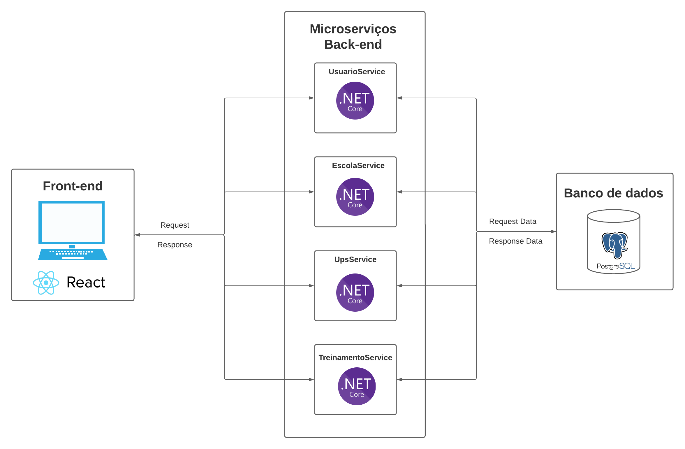

# Documento de Arquitetura

## Versionamento
| Versão | Data | Modificação | Autor |
|--|--|--|--|
|1.0| 26/05/2023 | Criação do documento | Lucas Rodrigues |
|1.1| 26/05/2023 | Incluindo informações da visão de dados | Antônio Neto, João de Matos, Lucas Rodrigues |
|1.2| 04/06/2023 | Atualização diagrama de arquitetura | Denys Rógeres |
|1.3| 04/06/2023 | Revisão do documento e Linkando referências | Yan Andrade de Sena |
|1.4| 09/07/2023 | Atualização documento | Yan Andrade de Sena |
|1.5| 10/07/2023 | Atualização documento | Denys Rogeres |

## Introdução
Este documento tem como objetivo detalhar a arquitetura do projeto, fornecendo uma visão geral da arquitetura e dos dados. Além disso são descritas as tecnologias utilizadas para o desenvolvimento.

## Tecnologias

### PostgreSQL
O PostgreSQL é um SGBD objeto-relacional que suporta grande parte do padrão SQL e disponibiliza recursos modernos, como chaves estrangeiras, triggers e consultas complexas. Uma de suas principais vantagens é o fato de ser uma ferramenta de código aberto que pode ser usada para fins privados, comerciais e acadêmicos.

### .NET
O ASP.NET, utilizado para o back-end da aplicação, é um framework de código aberto que permite a criação de serviços usando .NET e C#. É um framework rápido, escalonável e seguro, que possui recursos internos de proteção contra ameaças de segurança. Além disso, o fato da instituição cliente já estar familiarizada com .NET foi determinante para a escolha dessa tecnologia, a fim de facilitar a futura manutenção do software.

### xUnit
Para os testes do back-end foi escolhido o xUnit, uma ferramenta gratuita de código aberto com foco em testes unitários para aplicações .NET. É muito utilizada por ser simples, extensível e compatível com ferramentas de execução de teste.

### React
O React é uma biblioteca Javascript altamente flexível que permite a construção de interfaces de usuário interativas e responsivas. A construção das aplicações é feita por meio de componentes que possibilitam uma alta reutilização de código.

### Jest
Para os testes do front-end será usado o Jest, um framework de testes em Javascript simples, rápido e seguro. Permite escrever testes com uma API acessível, bem documentada e forncece relatórios de cobertura de código.

## Visão Geral
A arquitetura organizada em microsserviços permite a construção da aplicação separando serviços independentes que podem comunicar entre si por meio de APIs. Isso permite que os domínios sejam definidos de forma mais clara, permite uma maior escalabilidade, além de facilitar a manutenção e evolução do software.

A arquitetura do projeto consiste no front-end e 3 microsserviços no back-end, sendo o primeiro para a gestão dos usuários, o segundo para a gestão das escolas e o terceiro para lidar com a agenda de treinamentos realizados pelo DNIT. Além disso, o front-end em React faz a interface com o usuário.

### Front-end
Responsável por fornecer a interface com o usuário.

### UsuarioService
Este microsserviço é reponsável pelo gerenciamento de cadastro e autenticação de usuário, tanto funcionários do DNIT quanto de empresas executoras.

### EscolaService
Este microsserviço é reponsável pelo gerenciamento das escolas cadastrados. Permitando o cadastro de escolas via planilha, de forma manual e também a exclusão e atualização de escolas.

### UpsService
Este microsserviço é reponsável pelo gerenciamento de cadastro, via planilha, de sinistros e rodovias. Além disso, o microserviço também é resposável por gerenciar o cálculo de UPS (Unidade Padrão de Severidade).

### TreinamentoService
Este microsserviço é responsável pelo gerenciamento da agenda/cronograma de ações.

### PostgreSQL
Representa o banco de dados utilizado, no caso, o PostgreSQL.

## Visão de Dados

### Modelagem de Dados

A modelagem de dados é um processo fundamental na área de gerenciamento de informações. Envolve a criação de representações estruturadas que descrevem entidades, relacionamentos e atributos dos dados, permitindo uma compreensão clara e organizada dos mesmos. Através da modelagem de dados, é possível criar diagramas que retratam de forma visual como os dados estão relacionados entre si, facilitando a análise, a tomada de decisões e o desenvolvimento de sistemas de informação eficientes.

### ME-R (Modelo ENtidade-Relacionamento)

#### Entidades
    ESCOLA
    REDE
    PORTE
    LOCALIZACAO
    ETAPAS_DE_ENSINO
    RODOVIA
    SINISTRO
    SITUACAO
    UNIDADE_FEDERATIVA
    MUNICIPIO
    USUARIO
    EMPRESA
    RECUPERACAO_SENHA

#### Atributos
    ESCOLA (<ins>id_escola</ins>, nome_escola, cep, endereco, latitude, longitude, numero_total_de_alunos, telefone, numero_total_de_docentes, id_rede, id_uf, id_municipio, id_porte, id_situacao, observacao, id_etapas_de_ensino, ultima_atualizacao)
    REDE (<ins>id_rede</ins>, descricao_rede)
    PORTE (<ins>id_porte</ins>, descricao_porte)
    LOCALIZACAO (<ins>id_localizacao</ins>, descricao_localizacao)
    ETAPAS_DE_ENSINO (<ins>id_etapas_de_ensino</ins>, descricao_etapas_de_ensino)
    RODOVIA (<ins>id_rodovia</ins>, sigla_uf, ano_apuracao, numero_rodovia, codigo_snv, tipo_trecho, local_inicio_fim, km_inicial, km_final, extensao, superficie, federal_coincidence, estadual_coincidence, estadual_coincidence, mp082, concessao_convenio)
    SINISTRO (<ins>id</ins>, uf, rodovia, quilometro, sentido, solo, data, tipo, causa, gravidade, feridos, mortos, ups, snv, latitude, longitude)
    SITUACAO (<ins>id_situacao</ins>, descricao_situacao)
    UNIDADE_FEDERATIVA (<ins>id</ins>, descricao, sigla)
    MUNICIPIO (<ins>id_municipio</ins>, nome, id_uf)
    USUARIO (<ins>id</ins>, nome, email, senha)
    EMPRESA (<ins>cnpj</ins>, razao_social)
    RECUPERACAO_SENHA (<ins>id</ins>, uuid, id_usuario)

#### Relacionamentos
    USUARIO - possui RECUPERACAO_SENHA (1:n)
    Um USUARIO possui zero ou mais RECUPERACAO_SENHA, uma RECUPERACAO_SENHA possui um ou mais USUARIO.

    USUARIO - possui - UNIDADE_FEDERATIVA (n:m)
    Um USUARIO possui uma única UNIDADE_FEDERATIVA, uma UNIDADE_FEDERATIVA possui uma ou mais USUARIO.

    USUARIO - possui - EMPRESA (n:m)
    Um USUARIO possui uma única EMPRESA, uma EMPRESA possui uma ou mais USUARIO.

    UNIDADE_FEDERATIVA - possui - MUNICIPIO (1:n)
    Uma UNIDADE_FEDERATIVA possui um ou mais MUNICIPIO, um MUNICIPIO possui só e somente uma única UNIDADE_FEDERATIVA.

    MUNICIPIO - possui - ESCOLA (0:1)
    Um MUNICIPIO possui zero ou mais ESCOLA, uma ESCOLA possui só e somente um único MUNICIPIO.

    UNIDADE_FEDERATIVA - possui - ESCOLA (0:1)
    Um UNIDADE_FEDERATIVA possui zero ou mais ESCOLA, uma ESCOLA possui só e somente uma única UNIDADE_FEDERATIVA.

    SITUACAO - possui - ESCOLA (1:n)
    Uma SITUACAO possui uma ou mais ESCOLA, uma ESCOLA possui só e somente uma única SITUACAO.

    REDE - possui - ESCOLA (1:n)
    Uma REDE possui uma ou mais ESCOLA, uma ESCOLA possui só e somente uma única REDE.

    LOCALIZACAO - possui - ESCOLA (1:n)
    Uma LOCALIZACAO possui uma ou mais ESCOLA, uma ESCOLA possui só e somente uma única LOCALIZACAO.

    PORTE - possui - ESCOLA (1:n)
    Um PORTE possui uma ou mais ESCOLA, uma ESCOLA possui só e somente um único PORTE.

    ESCOLA - possui - ETAPAS_DE_ENSINO (n:m)
    Uma ESCOLA possui uma ou mais ETAPAS_DE_ENSINO, uma ETAPAS_DE_ENSINO possui uma ou mais ESCOLA.

#### Diagrama Entidade-Relacionamento (DER)

Um dos diagramas amplamente utilizados na modelagem de dados é o Diagrama de Entidade-Relacionamento (DER). Ele permite representar as entidades (objetos do mundo real) e seus relacionamentos em um sistema de informação. 

O diagrama DER é uma ferramenta valiosa para visualizar a estrutura do banco de dados, identificar chaves primárias e estrangeiras, e compreender as relações entre as entidades, auxiliando no desenvolvimento e na implementação de sistemas de banco de dados eficazes.

O DER é composto por retângulos que representam as entidades, linhas que mostram as conexões entre elas, elipses que denotam os atributos das entidades e losangos que indicam o relacionamento entre duas entidades. 

#### DER

<iframe style="border: 1px solid rgba(0, 0, 0, 0.1);" width="800" height="450" src="https://www.figma.com/embed?embed_host=share&url=https%3A%2F%2Fwww.figma.com%2Ffile%2FJmNx2j4hrJsPu9zupsnamS%2FDER-3%3Ftype%3Ddesign%26node-id%3D0%253A1%26t%3DXE0Uet0nRxAAoySH-1" allowfullscreen></iframe>

#### DLD

<iframe style="border: 1px solid rgba(0, 0, 0, 0.1);" width="800" height="450" src="https://www.figma.com/embed?embed_host=share&url=https%3A%2F%2Fwww.figma.com%2Ffile%2F5YYpopoJUVvyEG1mwS48Pk%2FDER-2%3Ftype%3Ddesign%26node-id%3D3%253A333%26t%3DMSvBIhVRs7KWjrBj-1" allowfullscreen></iframe>

## Referências

> [1] ASP.NET. Disponível em: https://dotnet.microsoft.com/pt-br/apps/aspnet. Acesso em: 26 maio 2023.

> [2] Geekhunter. O que são microsserviços e como funcionam?. Disponível em: https://blog.geekhunter.com.br/arquitetura-de-microsservicos-x-arquitetura-monolitica/. Acesso em: 26 maio 2023.

> [3] Icaro Tech. O crescimento dos Microsserviços e a importância das APIs. Disponível em: https://icarotech.com/blog/o-crescimento-dos-microsservicos-e-a-importancia-das-apis/. Acesso em: 26 maio 2023.

> [4] Jest. Disponível em: https://jestjs.io/pt-BR/. Acesso em: 26 maio 2023.

> [5] PostgreSQL. Disponível em: https://www.postgresql.org/. Acesso em: 26 maio 2023.

> [6] React. Disponível em: https://react.dev/. Acesso em: 26 maio 2023.

> [7] xUnit. Disponível em: https://xunit.net/. Acesso em: 26 maio 2023.
