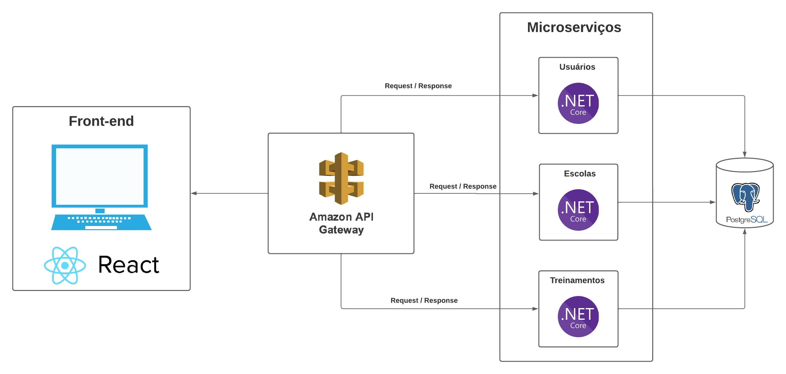

# Documento de Arquitetura

## Versionamento
| Versão | Data | Modificação | Autor |
|--|--|--|--|
|1.0| 26/05/2023 | Criação do documento | Lucas Rodrigues |
|1.1| 26/05/2023 | Incluindo informações da visão de dados | Antônio Neto, João de Matos, Lucas Rodrigues |
|1.2| 04/06/2023 | Atualização diagrama de arquitetura | Denys Rógeres |

## Introdução
Este documento tem como objetivo detalhar a arquitetura do projeto, fornecendo uma visão geral da arquitetura e dos dados. Além disso são descritas as tecnologias utilizadas para o desenvolvimento.

## Tecnologias

### PostgreSQL
O PostgreSQL é um SGBD objeto-relacional que suporta grande parte do padrão SQL e disponibiliza recursos modernos, como chaves estrangeiras, triggers e consultas complexas. Uma de suas principais vantagens é o fato de ser uma ferramenta de código aberto que pode ser usada para fins privados, comerciais e acadêmicos.

### .NET
O ASP.NET, utilizado para o back-end da aplicação, é um framework de código aberto que permite a criação de serviços usando .NET e C#. É um framework rápido, escalonável e seguro, que possui recursos internos de proteção contra ameaças de segurança. Além disso, o fato da instituição cliente já estar familiarizada com .NET foi determinante para a escolha dessa tecnologia, a fim de facilitar a futura manutenção do software.

### xUnit
Para os testes do back-end foi escolhido o xUnit, uma ferramenta gratuita de código aberto com foco em testes unitários para aplicações .NET. É muito utilizada por ser simples, extensível e compatível com ferramentas de execução de teste.

### React
O React é uma biblioteca Javascript altamente flexível que permite a construção de interfaces de usuário interativas e responsivas. A construção das aplicações é feita por meio de componentes que possibilitam uma alta reutilização de código.

### Jest
Para os testes do front-end será usado o Jest, um framework de testes em Javascript simples, rápido e seguro. Permite escrever testes com uma API acessível, bem documentada e forncece relatórios de cobertura de código.

## Visão Geral
A arquitetura organizada em microsserviços permite a construção da aplicação separando serviços independentes que podem comunicar entre si por meio de APIs. Isso permite que os domínios sejam definidos de forma mais clara, permite uma maior escalabilidade, além de facilitar a manutenção e evolução do software.

A arquitetura do projeto consiste no front-end e 3 microsserviços no back-end, sendo o primeiro para a gestão dos usuários, o segundo para a gestão das escolas e o terceiro para lidar com a agenda de treinamentos realizados pelo DNIT. Além disso, o front-end em React faz a interface com o usuário.

### Front-end
Responsável por fornecer a interface com o usuário.

### Amazon API Gateway
O Amazon API Gateway é um serviço fundamental da Amazon Web Services (AWS) que permite aos desenvolvedores criar, implantar e gerenciar APIs de forma eficiente, fornecendo uma interface poderosa para integrar aplicativos e serviços, garantindo escalabilidade, segurança, controle de tráfego e análise de desempenho.

### Usuários
Este microsserviço é reponsável pelo gerenciamento dos usuários cadastrados, tanto funcionários do DNIT quanto de empresas executoras.

### Escolas
Este microsserviço é reponsável pelo gerenciamento das escolas cadastrados e pela priorização dessas escolas.

### Treinamentos
Este microsserviço é responsável pelo gerenciamento da agenda/cronograma de visitas.

## Visão de Dados

### Modelagem de Dados

A modelagem de dados é um processo fundamental na área de gerenciamento de informações. Envolve a criação de representações estruturadas que descrevem entidades, relacionamentos e atributos dos dados, permitindo uma compreensão clara e organizada dos mesmos. Através da modelagem de dados, é possível criar diagramas que retratam de forma visual como os dados estão relacionados entre si, facilitando a análise, a tomada de decisões e o desenvolvimento de sistemas de informação eficientes.

### Modelo Entidade-Relacionamento (MER)

O Modelo Entidade-Relacionamento (MER) é uma técnica de modelagem de dados amplamente utilizada na engenharia de software. Ele permite representar as entidades (objetos) de um sistema, seus atributos e relacionamentos, fornecendo uma visão estruturada e visual dos dados. O MER é composto por entidades, atributos e relacionamentos, permitindo a definição clara e precisa das informações a serem armazenadas em um banco de dados, auxiliando no desenvolvimento de sistemas e na compreensão da estrutura e interações entre os dados.

### Entidades

**Usuário**

&nbsp;&nbsp;&nbsp;&nbsp;&nbsp;&nbsp;**Usuário DNIT**

&nbsp;&nbsp;&nbsp;&nbsp;&nbsp;&nbsp;**Usuário Empresa**

**Unidades federativas**

**Empresas**

**Escolas**

**Visitas**

**Dados para UPS**

**Rankings de escolas**

### Atributos

**Usuário** {nome, <u>email</u>
, senha}

&nbsp;&nbsp;&nbsp;&nbsp;&nbsp;&nbsp;**Usuário DNIT** {Unidade Federativa}

&nbsp;&nbsp;&nbsp;&nbsp;&nbsp;&nbsp;**Usuário Empresa** {Número de identificação}

**Unidades federativas** {<u>id</u> , sigla, nomeUF}

**Empresas** {<u>id</u>, nome, CNPJ}

**Escolas** {<u>id</u>, nome, email, dados(numeroAlunos, numeroFuncionarios), endereço(UF, cidade, rua, numero), coordenandas(coordX, coordY)}

**Visitas** {<u>id</u>, data, status, qtdAções(atributo derivado)}

**Dados para UPS** {<u>data(ano, mes)</u>, acidentes com danos materiais, acidentes com feridos, acidentes com pedestres, acidentes com vitimas fatais, valor da UPS(atributo derivado)}

**Rankings de escolas** {<u>id</u>, data(ano, mes)}

### Relacionamentos 

- **Usuário DNIT PERTENCE a Unidade Federativa**:

Um Usuário DNIT pertence a uma Unidade Federativa (UF), e uma Unidade Federativa pode ter vários funcionários DNIT.

Cardinalidade: n:1

- **Usuário Empresa PERTENCE a uma Empresa**:

Um Usuário Empresa pertence a uma Empresa, e uma Empresa pode ter vários funcionários Empresa.

Cardinalidade: n:1

- **Usuário DNIT SOLICITA Ranking de Escolas**:

Um Usuário DNIT solicita vários Rankings de Escola, e um Ranking de Escola é solicitado por um Usuário DNIT.

Cardinalidade: 1:n

- **Usuário Empresa SOLICITA uma Visita**:

Um Usuário Empresa solicita várias Visitas, e uma Visita é solicitada por um Usuário Empresa

Cardinalidade: 1:n

- **Visita É RECEBIDA por uma Escola**:

Uma Visita é recebida por uma Escola, e uma Escola pode receber várias visitas.

Cardinalidade: n:1

- **Escola POSSUI Dados para UPS**:

Uma Escola pode possuir vários Dados para UPS, e um conjunto de Dados para UPS é obtido por apenas uma Escola.

Cardinalidade: n:1

- **Dados para UPS GERA Ranking de escolas**:

Vários Dados para UPS gera um Ranking de Escola, e um Ranking de Escolas é gerado por vários Dados de Escola.

Cardinalidade: n:1

### Diagrama Entidade-Relacionamento (DER)

Um dos diagramas amplamente utilizados na modelagem de dados é o Diagrama de Entidade-Relacionamento (DER). Ele permite representar as entidades (objetos do mundo real) e seus relacionamentos em um sistema de informação. 

O diagrama DER é uma ferramenta valiosa para visualizar a estrutura do banco de dados, identificar chaves primárias e estrangeiras, e compreender as relações entre as entidades, auxiliando no desenvolvimento e na implementação de sistemas de banco de dados eficazes.

O DER é composto por retângulos que representam as entidades, linhas que mostram as conexões entre elas, elipses que denotam os atributos das entidades e losangos que indicam o relacionamento entre duas entidades. 

Foram realizados 3 versões do DER e utilizamos a últimas e mais atualizada. Veja abaixo as 3 versões dos diagramas ER feito pelo time:

#### DER 1

A primeira versão do DER indica apenas uma entidade para representar o funcionário. E para diferenciar um funcionário DNIT de um funcionário de uma empresa terceirizada, temos o atributo "Tipo" nessa entidade, podendo ser Tipo DNIT ou Tipo Terceirizada.

<iframe style="border: 1px solid rgba(0, 0, 0, 0.1);" width="800" height="450" src="https://www.figma.com/embed?embed_host=share&url=https%3A%2F%2Fwww.figma.com%2Ffile%2F0DqIpGsir4qyuqMo7VqaWT%2FDER-1%3Ftype%3Ddesign%26node-id%3D0%253A1%26t%3DUVrFJ3WOfoowMx2q-1" allowfullscreen></iframe>

#### DER 2

Na segunda versão separamos o funcionário DNIT e funcionário Terceirizada em duas entidades diferentes.

<iframe style="border: 1px solid rgba(0, 0, 0, 0.1);" width="800" height="450" src="https://www.figma.com/embed?embed_host=share&url=https%3A%2F%2Fwww.figma.com%2Ffile%2F5YYpopoJUVvyEG1mwS48Pk%2FDER-2%3Ftype%3Ddesign%26node-id%3D3%253A333%26t%3DMSvBIhVRs7KWjrBj-1" allowfullscreen></iframe>

#### DER 3 (Atual)

Na terceira versão, fazemos um especialização para o funcinário DNIT e funcionário Terceirizada. Criamos a generalização "Funcionário" que vai conter os atributos em comum, e as especializações com os atributos específicos.
Em discussão com a equipe, concluimos que esta especialização é a melhor forma de lidar com as diferenças de dados fornecidos para os dois tipos de usuario, mantendo suas atibuições em comum.
Este DER representa a versão mais recente.

<iframe style="border: 1px solid rgba(0, 0, 0, 0.1);" width="800" height="450" src="https://www.figma.com/embed?embed_host=share&url=https%3A%2F%2Fwww.figma.com%2Ffile%2FJmNx2j4hrJsPu9zupsnamS%2FDER-3%3Ftype%3Ddesign%26node-id%3D0%253A1%26t%3DXE0Uet0nRxAAoySH-1" allowfullscreen></iframe>

## Referências

ASP.NET. Disponível em: https://dotnet.microsoft.com/pt-br/apps/aspnet. Acesso em: 26 mai. 2023.

Geekhunter. O que são microsserviços e como funcionam?. Disponível em: https://blog.geekhunter.com.br/arquitetura-de-microsservicos-x-arquitetura-monolitica/. Acesso em: 26 mai. 2023.

Icaro Tech. O crescimento dos Microsserviços e a importância das APIs. Disponível em: https://icarotech.com/blog/o-crescimento-dos-microsservicos-e-a-importancia-das-apis/. Acesso em: 26 mai. 2023.

Jest. Disponível em: https://jestjs.io/pt-BR/. Acesso em: 26 mai. 2023.

PostgreSQL. Disponível em: https://www.postgresql.org/. Acesso em: 26 mai. 2023.

React. Disponível em: https://react.dev/. Acesso em: 26 mai. 2023.

xUnit. Disponível em: https://xunit.net/. Acesso em: 26 mai. 2023.
